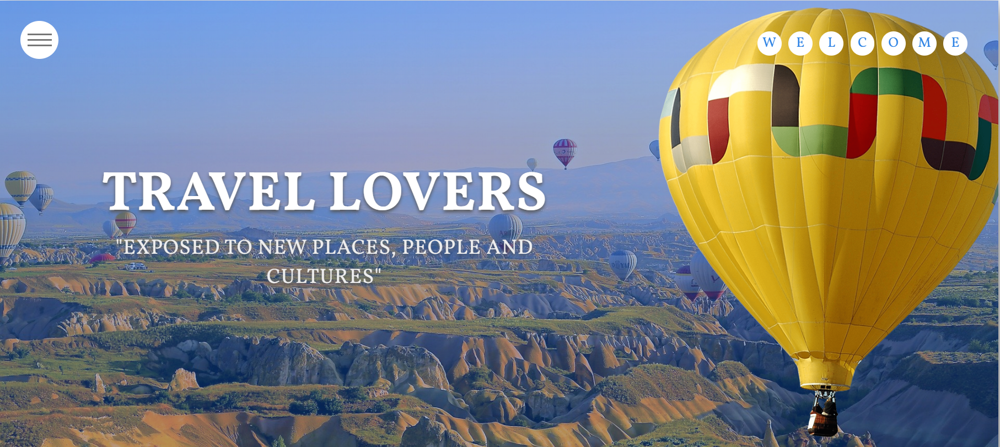
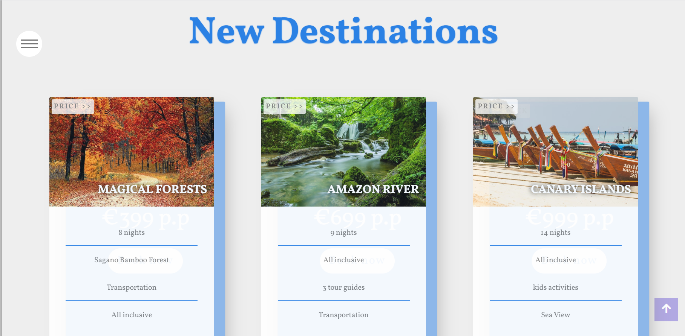
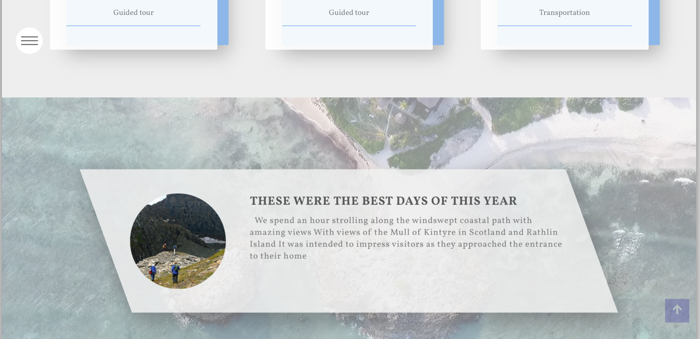
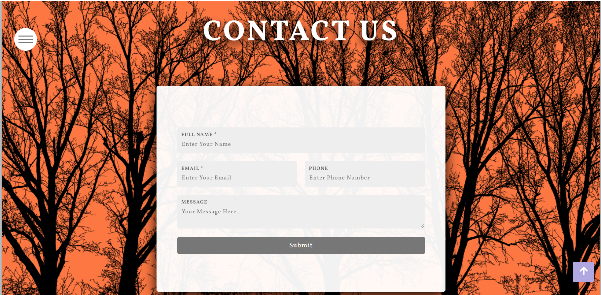
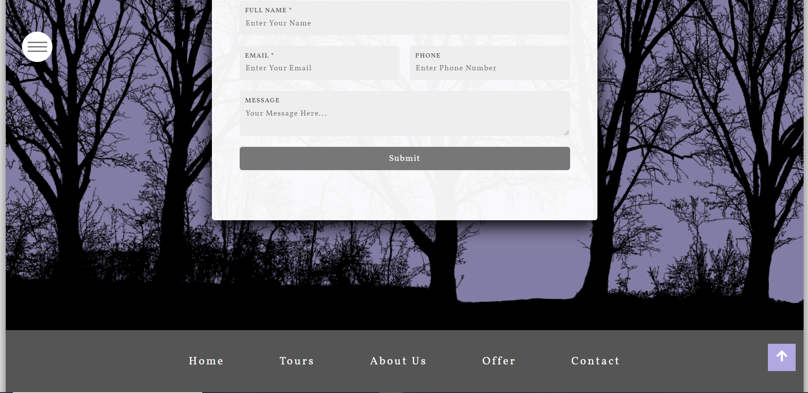

<h1 align="center">Interactive Frontend Development Milestone Project</h1>

[View the live project here.](https://abdoelsaih.github.io/Interactive-Frontend-Development-Milestone-Project/index.html)


This is a front-end website called "Travel Lovers "  . It is designed to be responsibe and accessible on a range of devices

## User Experience (UX)

-   ### User stories

    -   #### First Time Visitor Goals

        1. As a First Time Visitor, It is easily to understand the main purpose of the site and learn more about it.

    -   #### Returning Visitor Goals

        1. As a Returning Visitor, There are all the information about the trips and booking
        2. As a Returning Visitor, There is form to get in contact with the organisation with any questions I may have.

-   ### Design
    -   #### Colour Scheme
        -   The two main colours used are yellow, grey and blue 
    -   #### Typography
        -   The vollkorn font is the main font used throughout the whole website with Sans Serif as the fallback font
    -   #### Imagery
        -   Imagery is important. The large, background hero image is designed to be striking and catch the user's attention. It also has a modern, energetic aesthetic.   


*   ### Wireframes

    -   Home Page Wireframe - [View](https://abdoelsaih.github.io/Interactive-Frontend-Development-Milestone-Project/index.html)

    -   About Us  Wireframe - [View](https://abdoelsaih.github.io/Interactive-Frontend-Development-Milestone-Project/about.html)

    -   Contact Us Page Wireframe - [View](https://abdoelsaih.github.io/Interactive-Frontend-Development-Milestone-Project/contact.html)

    -   Offers Page Wireframe - [View](https://abdoelsaih.github.io/Interactive-Frontend-Development-Milestone-Project/offer.html)

    ## Features

-   Responsive on all device sizes

-   Interactive elements

## Technologies Used

### Languages Used

-   [HTML](https://en.wikipedia.org/wiki/HTML)
-   [CSS](https://en.wikipedia.org/wiki/Cascading_Style_Sheets)
-   [JavaScript](https://en.wikipedia.org/wiki/JavaScript)
-   [Pexels](https://www.pexels.com/search/free%20download/) - free download photos

### Frameworks, Libraries & Programs Used

1. [Google Fonts:](https://fonts.google.com/)
    - Google fonts were used to import the 'Titillium Web' font into the style.css file which is used on all pages throughout the project.
1. [Font Awesome:](https://fontawesome.com/)
    - Font Awesome was used on all pages throughout the website to add icons for aesthetic and UX purposes.
1. [Git](https://git-scm.com/)
    - Git was used for version control by utilizing the Gitpod terminal to commit to Git and Push to GitHub.
1. [GitHub:](https://github.com/)
    - GitHub is used to store the projects code after being pushed from Git.

## Testing

The W3C Markup Validator and W3C CSS Validator Services were used to validate every page of the project to ensure there were no syntax errors in the project.

-   [W3C Markup Validator](https://jigsaw.w3.org/css-validator/#validate_by_input) 
-   [W3C CSS Validator](https://jigsaw.w3.org/css-validator/#validate_by_input) 


### Testing User Stories from User Experience (UX) Section

-   #### First Time Visitor Goals

    1. As a First Time Visitor, It is easily to understand the main purpose of the site and learn more about it.

        1. Upon entering the site, users are automatically greeted with a clean and easily readable navigation bar to go to the page of their choice. Underneath there is a Hero Image with Text and a "Learn More" Call to action button.
        2. The main points are made immediately with the hero image
        3. The user has two options, click the call to action buttons or scroll down, both of which will lead to the same place, to learn more about the organisation.


-   #### Returning Visitor Goals

    1. As a Returning Visitor, There are all the information about the trips and booking

        1. These are clearly shown in the banner message.

    2. As a Returning Visitor, There is form to get in contact with the organisation with any questions I may have.

        1. The navigation bar clearly highlights the "Contact Us" Page.
        2. Here they can fill out the form on the page or are told that alternatively they can message the organisation on social media.
        5. The email button is set up to automatically open up your email app and autofill there email address in the "To" section.


### Further Testing

-   The Website was tested on Google Chrome, Internet Explorer, Microsoft Edge and Safari browsers.
-   The website was viewed on a variety of devices such as Desktop, Laptop, iPhone7, iPhone 8 & iPhoneX.
-   A large amount of testing was done to ensure that all pages were linking correctly.
-   Friends and family members were asked to review the site and documentation to point out any bugs and/or user experience issues.

### Known Bugs

-   On some mobile devices the Hero Image pushes the size of screen out more than any of the other content on the page.
    -   A white gap can be seen to the right of the footer and navigation bar as a result.
-   On Microsoft Edge and Internet Explorer Browsers, all links in Navbar are pushed upwards when hovering over them.

## Deployment

### GitHub Pages
The project was deployed to GitHub Pages using the following steps...

1. Log in to GitHub and locate the [GitHub Repository](https://github.com/)
2. At the top of the Repository (not top of page), locate the "Settings" Button on the menu.
    - Alternatively Click [Here](https://raw.githubusercontent.com/) for a GIF demonstrating the process starting from Step 2.
3. Scroll down the Settings page until you locate the "GitHub Pages" Section.
4. Under "Source", click the dropdown called "None" and select "Master Branch".
5. The page will automatically refresh.
6. Scroll back down through the page to locate the now published site [link](https://github.com) in the "GitHub Pages" section.

### Forking the GitHub Repository

By forking the GitHub Repository we make a copy of the original repository on our GitHub account to view and/or make changes without affecting the original repository by using the following steps...

1. Log in to GitHub and locate the [GitHub Repository](https://github.com/)
2. At the top of the Repository (not top of page) just above the "Settings" Button on the menu, locate the "Fork" Button.
3. You should now have a copy of the original repository in your GitHub account.

### Making a Local Clone

1. Log in to GitHub and locate the [GitHub Repository](https://github.com/)
2. Under the repository name, click "Clone or download".
3. To clone the repository using HTTPS, under "Clone with HTTPS", copy the link.
4. Open Git Bash
5. Change the current working directory to the location where you want the cloned directory to be made.
6. Type `git clone`, and then paste the URL you copied in Step 3.

```
$ git clone https://abdoelsaih.github.io/Interactive-Frontend-Development-Milestone-Project/index.html
```

7. Press Enter. Your local clone will be created.

```
$ git clone https://abdoelsaih.github.io/Interactive-Frontend-Development-Milestone-Project/index.html
> Cloning into `CI-Clone`...
> remote: Counting objects: 10, done.
> remote: Compressing objects: 100% (8/8), done.
> remove: Total 10 (delta 1), reused 10 (delta 1)
> Unpacking objects: 100% (10/10), done.
```

### Screenshots






